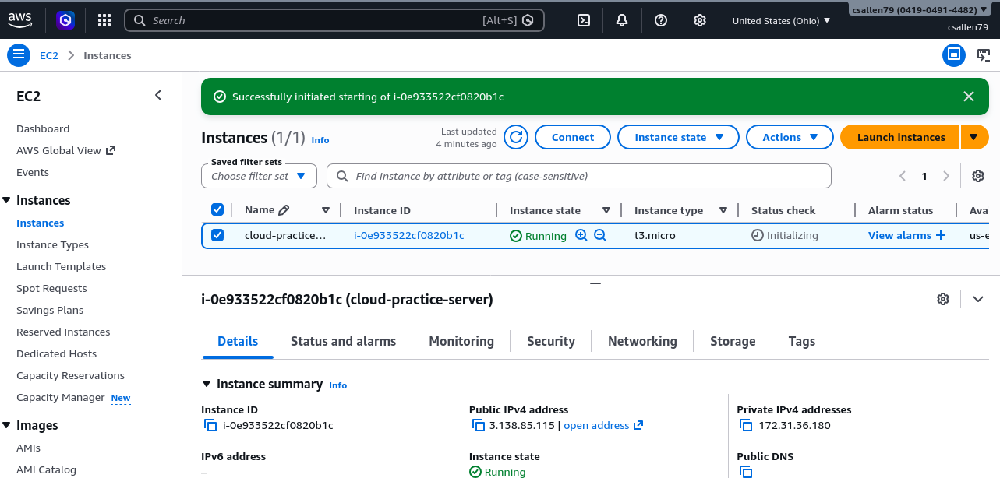
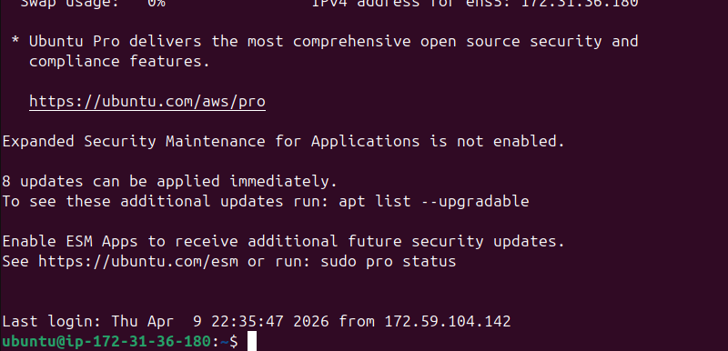
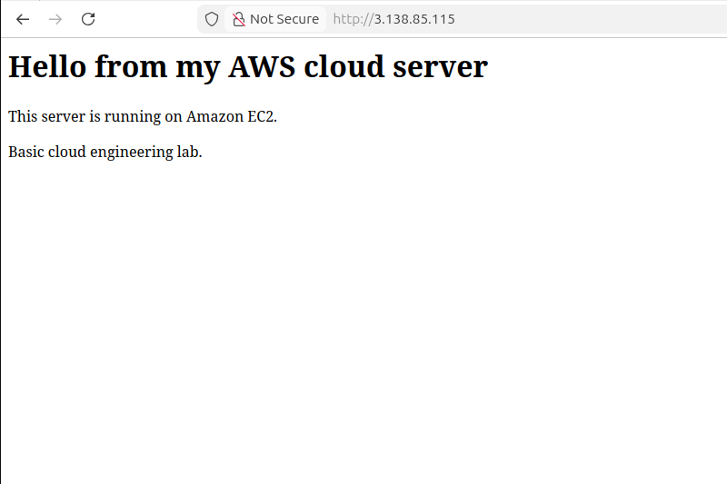

# AWS EC2 Web Server Lab

## Project Overview
This project demonstrates how to deploy a Linux web server using Amazon Web Services.

## Architecture
User Browser → Internet → AWS EC2 Instance → Apache Web Server → HTML Webpage

## Technologies Used
- AWS EC2
- Ubuntu Linux
- Apache Web Server
- SSH Key Authentication

## Deployment Steps

1. Created an EC2 instance in AWS
2. Configured security groups
   - SSH (port 22) restricted to my IP
   - HTTP (port 80) open to the internet
3. Connected to the server using SSH
4. Updated the system packages
5. Installed Apache
6. Edited the webpage located at:

/var/www/html/index.html

7. Deployed a custom webpage

## Result

A publicly accessible webpage hosted from an AWS EC2 instance.

## Skills Demonstrated

- Cloud Infrastructure Deployment
- Linux Administration
- Web Server Configuration
- Networking and Security Groups
## Project Screenshots

### EC2 Instance

### SSH Connection

### Web Server Running

